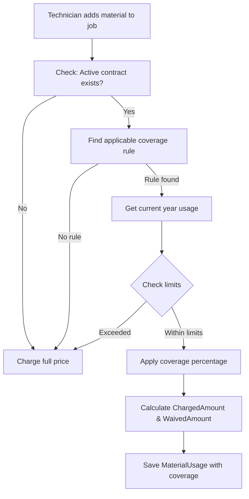

# AMC Contract Component Coverage System

## Overview

This system manages Annual Maintenance Contract (AMC) coverage for component replacements in service jobs. It allows you to define which components are free, chargeable, or partially covered under a customer's contract, with automatic calculation of charges and tracking of usage limits.

## Business Scenario

**Problem**: Customer has a 5-year AMC contract. Some component replacements during jobs are free (covered by AMC), while others are chargeable.

**Solution**: Define coverage rules per contract that specify:
- Which items are free, chargeable, or partially covered
- Usage limits (quantity or value per year)
- Automatic calculation of what to charge the customer

## Architecture

### Data Model

```
Contract (5-year AMC)
    ├── CoverageRules (Define what's covered)
    │   ├── Specific Item Rule (e.g., "Filters are free, max 4/year")
    │   ├── Category Rule (e.g., "All spare parts are 50% off")
    │   └── Default Rule (e.g., "Everything else is chargeable")
    │
    └── MaterialUsage (Track actual usage in jobs)
        ├── Original Amount (Qty × Price)
        ├── ChargedAmount (What customer pays)
        └── WaivedAmount (What contract covers)
```

### Key Entities

#### 1. **Contract**
Enhanced with coverage fields:
```csharp
public class Contract : BaseClass
{
    public string Title { get; set; }
    public Guid CustomerId { get; set; }
    public DateTimeOffset? StartDate { get; set; }
    public DateTimeOffset? EndDate { get; set; }
    public bool IsActive { get; set; }

    // Coverage fields
    public ContractCoverageType CoverageType { get; set; } // FullCoverage, PartialCoverage, LaborOnly
    public bool IncludesPartsReplacement { get; set; }
    public decimal? PartsReplacementLimit { get; set; } // Optional overall limit per year

    // Navigation
    public ICollection<ContractCoverageRule> CoverageRules { get; set; }
}
```

#### 2. **ContractCoverageRule**
Defines coverage for specific items/categories:
```csharp
public class ContractCoverageRule : BaseClass
{
    public Guid ContractId { get; set; }

    // Rule specificity (all optional - null = applies to all)
    public Guid? InventoryItemId { get; set; }      // Specific item
    public Guid? InventoryItemCategoryId { get; set; } // Item category

    // Coverage details
    public CoverageRuleType CoverageType { get; set; } // Free, Chargeable, PartiallyChargeable
    public decimal ChargePercentage { get; set; }      // 0-100% (0=free, 100=full price)

    // Limits
    public int? MaxQuantityPerYear { get; set; }    // Max qty allowed per year
    public decimal? MaxValuePerYear { get; set; }   // Max value allowed per year

    // Priority for conflict resolution
    public int Priority { get; set; } // Lower = higher priority
}
```

**Coverage Rule Types:**
- `Free` (0% charge) - Fully covered by contract
- `Chargeable` (100% charge) - Not covered, customer pays full price
- `PartiallyChargeable` (custom %) - Contract covers part, customer pays rest

#### 3. **MaterialUsage**
Enhanced with coverage tracking:
```csharp
public class MaterialUsage : VoucherLine
{
    // Standard fields
    public Guid VoucherId { get; set; } // JobId
    public Guid ItemId { get; set; }
    public double Quantity { get; set; }
    public decimal UnitPrice { get; set; }

    // Coverage tracking
    public Guid? ContractCoverageRuleId { get; set; }
    public decimal ChargedAmount { get; set; }      // Amount charged to customer
    public decimal WaivedAmount { get; set; }       // Amount covered by contract
    public string? CoverageNotes { get; set; }      // "Covered under AMC Contract #123"

    // Calculated
    public decimal TotalValue => Quantity × UnitPrice;  // Original amount
}
```

## Coverage Rule Priority System

When a component is added to a job, the system finds the applicable coverage rule using this priority:

### Priority 1: Exact Item Match
```
Rule: InventoryItemId = ABC-123
Applies to: Only item ABC-123
Example: "Air Filters (ABC-123) are free, max 4/year"
```

### Priority 2: Category Match
```
Rule: InventoryItemCategoryId = "Spare Parts"
Applies to: All items in "Spare Parts" category
Example: "All spare parts get 50% discount"
```

### Priority 3: Default Rule
```
Rule: Both InventoryItemId and CategoryId are null
Applies to: All items not matched by above rules
Example: "Everything else is chargeable at full price"
```

**Rule Matching Flow:**
```
Item Added to Job
    ↓
Check: Exact item rule exists?
    ↓ NO
Check: Category rule exists?
    ↓ NO
Check: Default rule exists?
    ↓ NO
Charge full price (no coverage)
```

## Usage Tracking

### Real-Time Calculation (No Tracking Table)

Usage is calculated on-demand from existing `MaterialUsage` records using SQL views/functions:

**PostgreSQL Function:**
```sql
GetContractItemUsage(contractId, inventoryItemId, year)
Returns:
    - QuantityUsed: Total quantity used this year
    - ValueUsed: Total value used this year
    - ChargedAmount: Total charged to customer
    - WaivedAmount: Total waived by contract
```

**How it works:**
1. Finds all Jobs for the contract's customer within contract period
2. Filters MaterialUsages for those jobs
3. Aggregates by year and item
4. Returns real-time totals

### Usage Limit Enforcement

When applying coverage, system checks:

```csharp
Current Year Usage + New Request > Limit?
    ↓ YES
    Charge full price (limit exceeded)
    ↓ NO
    Apply coverage discount
```

**Example:**
```
Rule: Filters are free, max 4/year
Current usage: 3 filters used this year
Request: 2 new filters

Calculation:
3 + 2 = 5 > 4 (limit exceeded)
Result: Charge full price for both filters
```

## Coverage Application Process

### Step-by-Step Flow



### Code Example

```csharp
// When adding material to a job
var job = await jobService.GetByIdAsync(jobId);
var contract = await contractCoverageService.GetActiveContractAsync(
    job.CustomerId,
    DateTime.UtcNow);

if (contract != null)
{
    // Apply coverage
    var coverage = await contractCoverageService.ApplyCoverageAsync(
        contract.Oid,
        inventoryItemId,
        quantity: 2,
        unitPrice: 50.00m);

    // Result:
    // coverage.OriginalAmount = 100.00
    // coverage.ChargedAmount = 0.00 (if free)
    // coverage.WaivedAmount = 100.00
    // coverage.Notes = "Covered under AMC Contract"

    materialUsage.ChargedAmount = coverage.ChargedAmount;
    materialUsage.WaivedAmount = coverage.WaivedAmount;
    materialUsage.CoverageNotes = coverage.Notes;
}
else
{
    // No contract - charge full price
    materialUsage.ChargedAmount = quantity * unitPrice;
}
```

## Example Scenarios

### Scenario 1: HVAC Maintenance Contract

**Contract Setup:**
```
Contract: 5-year HVAC AMC
Customer: ABC Corp
Start: 2024-01-01, End: 2028-12-31

Coverage Rules:
┌─────────────────────┬──────────────┬──────────┬────────────┐
│ Item/Category       │ Coverage     │ Charge % │ Limits     │
├─────────────────────┼──────────────┼──────────┼────────────┤
│ Air Filters         │ Free         │ 0%       │ 4/year     │
│ Drive Belts         │ Free         │ 0%       │ 2/year     │
│ Spare Parts (cat)   │ Partial      │ 50%      │ $500/year  │
│ Compressor          │ Chargeable   │ 100%     │ -          │
│ Default (all else)  │ Chargeable   │ 100%     │ -          │
└─────────────────────┴──────────────┴──────────┴────────────┘
```

**Job 1 - March 2024:**
```
Material: 2× Air Filters @ $25 each
    ↓
Rule: Free, max 4/year
Current usage: 0 filters
    ↓
2 + 0 = 2 ≤ 4 (within limit)
    ↓
Result:
    Original: $50.00
    Charged: $0.00 ✓
    Waived: $50.00
    Notes: "Covered under AMC Contract"
```

**Job 2 - June 2024:**
```
Material: 3× Air Filters @ $25 each
    ↓
Rule: Free, max 4/year
Current usage: 2 filters (from Job 1)
    ↓
3 + 2 = 5 > 4 (LIMIT EXCEEDED)
    ↓
Result:
    Original: $75.00
    Charged: $75.00 ✗ (Full price)
    Waived: $0.00
    Notes: "Quantity limit exceeded (4/year) - Full charge applies"
```

**Job 3 - Same month:**
```
Material: 1× Drive Belt @ $100
    ↓
Rule: Free, max 2/year
Current usage: 0 belts
    ↓
1 + 0 = 1 ≤ 2 (within limit)
    ↓
Result:
    Original: $100.00
    Charged: $0.00 ✓
    Waived: $100.00
```

**Job 4 - August 2024:**
```
Material: 1× Spare Part (category) @ $200
    ↓
Rule: Partial (50%), max $500/year
Current usage: $0 (first spare part this year)
    ↓
200 + 0 = 200 ≤ 500 (within limit)
    ↓
Result:
    Original: $200.00
    Charged: $100.00 (50%)
    Waived: $100.00 (50%)
    Notes: "50% discount applied (50% charged)"
```

**Job 5 - December 2024:**
```
Material: 1× Compressor @ $1,500
    ↓
Rule: Chargeable (100%)
    ↓
Result:
    Original: $1,500.00
    Charged: $1,500.00 ✗
    Waived: $0.00
    Notes: "Chargeable item - Not covered by contract"
```

### Scenario 2: IT Equipment AMC

**Contract Setup:**
```
Contract: 3-year IT Support AMC
Customer: XYZ Inc

Coverage Rules:
┌─────────────────────┬──────────────┬──────────┬────────────┐
│ Item/Category       │ Coverage     │ Charge % │ Limits     │
├─────────────────────┼──────────────┼──────────┼────────────┤
│ RAM/Storage         │ Free         │ 0%       │ $1000/year │
│ Monitors            │ Free         │ 0%       │ 2/year     │
│ Mouse/Keyboard      │ Free         │ 0%       │ Unlimited  │
│ Motherboard/CPU     │ Partial      │ 50%      │ -          │
│ Default             │ Chargeable   │ 100%     │ -          │
└─────────────────────┴──────────────┴──────────┴────────────┘
```

**Usage Example:**
```
Year 1:
- 4× Mouse @ $20 = $80 → Charged: $0 (Free, unlimited)
- 2× Monitor @ $200 = $400 → Charged: $0 (Free, 2/year limit met)
- 1× RAM @ $150 = $150 → Charged: $0 (Free, $850 remaining)
- 1× CPU @ $600 = $600 → Charged: $300 (50% coverage)

Year 2:
- Limits reset (new year)
- Same coverage rules apply
```

## Service Layer API

### ContractCoverageService

```csharp
// Get active contract for customer
var contract = await contractCoverageService.GetActiveContractAsync(
    customerId: Guid,
    date: DateTimeOffset);

// Get applicable rule for an item
var rule = await contractCoverageService.GetApplicableCoverageRuleAsync(
    contractId: Guid,
    inventoryItemId: Guid);

// Get current year usage for item
var usage = await contractCoverageService.GetItemUsageAsync(
    contractId: Guid,
    inventoryItemId: Guid,
    year: int?); // Defaults to current year

// Get total contract usage (all items)
var totalUsage = await contractCoverageService.GetContractTotalUsageAsync(
    contractId: Guid,
    year: int?);

// Apply coverage and calculate amounts
var result = await contractCoverageService.ApplyCoverageAsync(
    contractId: Guid,
    inventoryItemId: Guid,
    quantity: decimal,
    unitPrice: decimal,
    year: int?);

// Result contains:
// - OriginalAmount: Total before coverage
// - ChargedAmount: Amount customer pays
// - WaivedAmount: Amount contract covers
// - CoverageApplied: bool
// - LimitExceeded: bool
// - Notes: Explanation
```

### MaterialCoverageResult DTO

```csharp
public class MaterialCoverageResult
{
    public Guid? CoverageRuleId { get; set; }
    public decimal OriginalAmount { get; set; }
    public decimal ChargedAmount { get; set; }
    public decimal WaivedAmount { get; set; }
    public bool CoverageApplied { get; set; }
    public bool LimitExceeded { get; set; }
    public decimal ChargePercentage { get; set; }
    public string? Notes { get; set; }
}
```

## Database Schema

### Tables

```sql
-- Contract table (enhanced)
Contracts
    ├── Oid (PK)
    ├── CustomerId (FK)
    ├── Title
    ├── StartDate
    ├── EndDate
    ├── IsActive
    ├── CoverageType (enum)
    ├── IncludesPartsReplacement (bool)
    └── PartsReplacementLimit (decimal)

-- Coverage rules
ContractCoverageRules
    ├── Oid (PK)
    ├── ContractId (FK)
    ├── InventoryItemId (nullable FK)
    ├── InventoryItemCategoryId (nullable FK)
    ├── CoverageType (enum)
    ├── ChargePercentage (0-100)
    ├── MaxQuantityPerYear (nullable)
    ├── MaxValuePerYear (nullable)
    ├── Priority (int)
    └── Notes

-- Material usage (enhanced)
MaterialUsages
    ├── Oid (PK)
    ├── VoucherId/JobId (FK)
    ├── ItemId (FK)
    ├── Quantity
    ├── UnitPrice
    ├── ContractCoverageRuleId (nullable FK)
    ├── ChargedAmount (NEW)
    ├── WaivedAmount (NEW)
    └── CoverageNotes (NEW)
```

### SQL Views

```sql
-- View: Contract usage summary
ContractComponentUsageSummary
    ├── ContractId
    ├── ItemId
    ├── UsageYear
    ├── TotalQuantityUsed
    ├── TotalValueUsed
    ├── TotalChargedAmount
    └── TotalWaivedAmount

-- Function: Get item usage for year
GetContractItemUsage(contractId, itemId, year)
    Returns: QuantityUsed, ValueUsed, ChargedAmount, WaivedAmount

-- Function: Get total usage for year
GetContractTotalUsage(contractId, year)
    Returns: TotalValueUsed, TotalChargedAmount, ItemCount
```

## Integration Points

### 1. Job Material Addition

**Before (No Coverage):**
```csharp
var material = new MaterialUsage
{
    JobId = jobId,
    ItemId = itemId,
    Quantity = 2,
    UnitPrice = 50.00m
};
// Total charged: $100.00
```

**After (With Coverage):**
```csharp
var job = await context.Jobs.FindAsync(jobId);
var contract = await coverageService.GetActiveContractAsync(
    job.CustomerId,
    job.CreatedAtUtc);

var material = new MaterialUsage
{
    JobId = jobId,
    ItemId = itemId,
    Quantity = 2,
    UnitPrice = 50.00m
};

if (contract != null)
{
    var coverage = await coverageService.ApplyCoverageAsync(
        contract.Oid, itemId, 2, 50.00m);

    material.ContractCoverageRuleId = coverage.CoverageRuleId;
    material.ChargedAmount = coverage.ChargedAmount; // e.g., $0 if free
    material.WaivedAmount = coverage.WaivedAmount;   // e.g., $100
    material.CoverageNotes = coverage.Notes;
}
else
{
    material.ChargedAmount = 100.00m; // No coverage
    material.WaivedAmount = 0;
}
```

### 2. Invoice Generation

**Show coverage details on invoice:**
```
INVOICE #12345
Customer: ABC Corp
Contract: 5-year HVAC AMC (#5678)

Items Covered Under AMC:
┌────────────────┬─────┬──────┬──────────┬─────────┐
│ Item           │ Qty │ Rate │ Amount   │ Covered │
├────────────────┼─────┼──────┼──────────┼─────────┤
│ Air Filters    │ 2   │ $25  │ $50.00   │ $50.00  │
│ Drive Belt     │ 1   │ $100 │ $100.00  │ $100.00 │
└────────────────┴─────┴──────┴──────────┴─────────┘
                        Subtotal (AMC):    $150.00
                        Amount Due:        $0.00

Chargeable Items:
┌────────────────┬─────┬──────┬──────────┐
│ Item           │ Qty │ Rate │ Amount   │
├────────────────┼─────┼──────┼──────────┤
│ Compressor     │ 1   │ $1500│ $1,500.00│
└────────────────┴─────┴──────┴──────────┘
                        Subtotal:  $1,500.00

                        Total Due: $1,500.00
```

### 3. Reporting

**Usage Report:**
```
Contract Usage Report - 2024
Contract: HVAC AMC #5678 (ABC Corp)

Item-wise Usage:
┌────────────────┬──────┬───────────┬─────────┬──────────┐
│ Item           │ Used │ Limit     │ Charged │ Waived   │
├────────────────┼──────┼───────────┼─────────┼──────────┤
│ Air Filters    │ 5    │ 4/year    │ $25.00  │ $100.00  │
│ Drive Belts    │ 1    │ 2/year    │ $0.00   │ $100.00  │
│ Spare Parts    │ -    │ $500/year │ $100.00 │ $100.00  │
└────────────────┴──────┴───────────┴─────────┴──────────┘

Summary:
Total Usage Value:    $325.00
Amount Charged:       $125.00
Amount Waived:        $200.00
Contract Savings:     61.5%
```

## Best Practices

### 1. Coverage Rule Design

**✅ DO:**
- Create specific rules for frequently replaced items
- Use category rules for bulk coverage
- Always create a default rule (fallback)
- Set realistic limits based on contract terms
- Document rules clearly in Notes field

**❌ DON'T:**
- Create overlapping rules without clear priorities
- Set limits too low (causes customer frustration)
- Forget to review/adjust limits annually

### 2. Priority Assignment

```
Priority 1-10:    Critical specific items
Priority 11-50:   Important specific items
Priority 51-90:   Category rules
Priority 91-100:  Default/fallback rules
```

### 3. Limit Management

**Quantity Limits:**
- Best for consumables (filters, belts, etc.)
- Easy for customers to understand
- Example: "4 filters per year"

**Value Limits:**
- Best for variable-cost items
- Provides budget flexibility
- Example: "$500 worth of spare parts per year"

**Unlimited:**
- Only for low-cost, high-frequency items
- Example: "Unlimited screws and bolts"

### 4. Contract Review

**Annual Tasks:**
1. Review usage reports
2. Adjust limits based on actual usage
3. Add new items/categories as needed
4. Remove obsolete rules
5. Verify pricing remains competitive

## Troubleshooting

### Common Issues

**Issue 1: Item not getting coverage**
```
Symptom: Item charged full price despite coverage rule
Check:
1. Is contract active? (IsActive = true)
2. Is current date within contract period?
3. Does coverage rule exist for this item?
4. Is priority set correctly?
5. Are usage limits exceeded?

Solution: Review coverage rules, check usage, verify dates
```

**Issue 2: Wrong coverage applied**
```
Symptom: Unexpected charge percentage
Check:
1. Which rule matched? (check Priority)
2. Is ChargePercentage set correctly?
3. Are there conflicting rules?

Solution: Verify rule priority and specificity
```

**Issue 3: Limits not enforcing**
```
Symptom: Usage exceeds limits but still free
Check:
1. Is year parameter correct in usage query?
2. Are MaterialUsages saved with correct dates?
3. Is SQL function working correctly?

Solution: Test SQL function directly, verify data
```

## Future Enhancements

### Potential Features

1. **Time-based Coverage**
   - Different coverage % by contract year
   - Example: "Free first 2 years, 50% year 3-5"

2. **Approval Workflow**
   - Require approval when limits exceeded
   - Notify customer before charging

3. **Auto-renewal**
   - Reset yearly limits automatically
   - Adjust limits based on historical usage

4. **Multi-tier Contracts**
   - Bronze/Silver/Gold coverage levels
   - Different limits per tier

5. **Proactive Alerts**
   - Warn technician before limit is reached
   - Suggest alternative items with coverage

6. **Customer Portal**
   - View usage vs. limits
   - Download usage reports
   - Request coverage exceptions

## Conclusion

This system provides comprehensive AMC coverage management with:
- ✅ Flexible rule-based coverage
- ✅ Automatic charge calculation
- ✅ Real-time usage tracking
- ✅ Limit enforcement
- ✅ Full audit trail
- ✅ No data duplication
- ✅ Database-level performance

**Key Benefits:**
- Reduces manual errors in billing
- Improves customer satisfaction (transparent coverage)
- Provides usage insights for contract renewal
- Scales to any contract complexity
- Maintains single source of truth (MaterialUsage)
